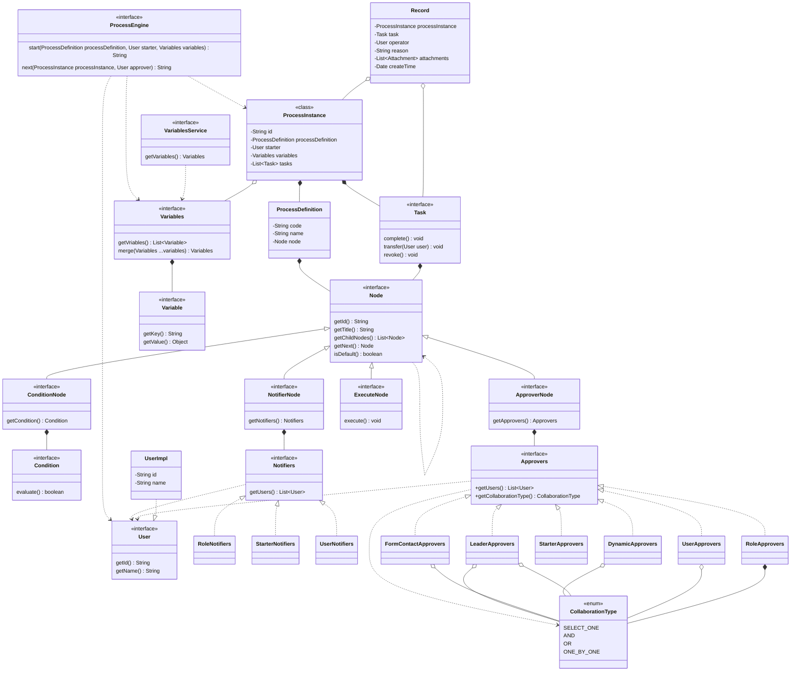
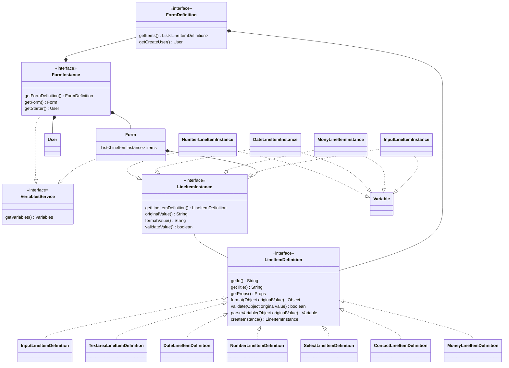

# 审批流引擎

## 流程引擎(ProcessEngine)

```mermaid
classDiagram

ProcessEngine ..> ProcessInstance
ProcessEngine ..> User
ProcessEngine ..> Variables

ProcessInstance *-- ProcessDefinition
ProcessDefinition *-- Node

class VariablesService {
<<interface>>
getVariables() Variables
}

VariablesService ..> Variables

class ProcessEngine {
<<interface>>
start(ProcessDefinition processDefinition, User starter, Variables variables) String
next(ProcessInstance processInstance, User approver) String
}

class Variables {
<<interface>>
getVriables() List~Variable~
merge(Variables ...variables) Variables
}

Variables *-- Variable

class ProcessInstance {
<<class>>
-String id
-ProcessDefinition processDefinition
-User starter
-Variables variables
-List~Task~ tasks
}

ProcessInstance o-- Variables
ProcessInstance *-- Task

Task *-- Node

class Task {
<<interface>>
complete() void
transfer(User user) void
revoke() void
}

class Variable {
<<interface>>
getKey() String
getValue() Object
}

class ProcessDefinition {
-String code
-String name
-Node node
}

class User {
<<interface>>
getId() String
getName() String
}

Node ..> Node

class Node {
<<interface>>
getId() String
getTitle() String
getChildNodes() List~Node~
getNext() Node
isDefault() boolean
}

class ConditionNode {
<<interface>>
getCondition() Condition
}

ConditionNode *-- Condition

class Condition {
<<interface>>
evaluate() boolean
}

Node <|-- NotifierNode
Node <|-- ApproverNode
Node <|-- ExecuteNode
Node <|-- ConditionNode

class ExecuteNode {
<<interface>>
execute() void
}

class ApproverNode {
<<interface>>
getApprovers() Approvers
}

class NotifierNode {
<<interface>>
getNotifiers() Notifiers
}

ApproverNode *-- Approvers
NotifierNode *-- Notifiers

class Notifiers {
<<interface>>
getUsers() List~User~
}

Notifiers ..> User

Notifiers <|.. RoleNotifiers
Notifiers <|.. StarterNotifiers
Notifiers <|.. UserNotifiers

class Approvers {
<<interface>>
+getUsers() List~User~
+getCollaborationType() CollaborationType
}

Approvers ..> CollaborationType
Approvers ..> User

Approvers <|.. LeaderApprovers
Approvers <|.. RoleApprovers
Approvers <|.. UserApprovers
Approvers <|.. StarterApprovers
Approvers <|.. DynamicApprovers
Approvers <|.. FormContactApprovers

LeaderApprovers o-- CollaborationType
FormContactApprovers o-- CollaborationType
DynamicApprovers o-- CollaborationType
LeaderApprovers o-- CollaborationType
UserApprovers o-- CollaborationType
RoleApprovers *-- CollaborationType

class CollaborationType {
<<enum>>
SELECT_ONE
AND
OR
ONE_BY_ONE
}

class UserImpl {
-String id
-String name
}

UserImpl ..|> User

class Record {
-ProcessInstance processInstance
-Task task
-User operator
-String reason
-List~Attachment~ attachments
-Date createTime
}

Record o-- Task
Record o-- ProcessInstance

```

## 表单引擎(FormEngine)

```mermaid
classDiagram

FormDefinition --* FormInstance

class FormDefinition {
<<interface>>
getItems() List~LineItemDefinition~
getCreateUser() User
}

FormDefinition *-- LineItemDefinition

VeriablesService <|.. FormInstance

class VeriablesService {
<<interface>>
getVariables() Variables
}

class LineItemDefinition {
<<interface>>
getId() String
getTitle() String
getProps() Props
format(Object originalValue) Object
validate(Object originalValue) boolean
parseVariable(Object originalValue) Variable
createInstance() LineItemInstance
}


LineItemDefinition <|.. InputLineItemDefinition
LineItemDefinition <|.. TextareaLineItemDefinition
LineItemDefinition <|.. DateLineItemDefinition
LineItemDefinition <|.. NumberLineItemDefinition
LineItemDefinition <|.. SelectLineItemDefinition
LineItemDefinition <|.. ContactLineItemDefinition
LineItemDefinition <|.. MoneyLineItemDefinition

class FormInstance {
<<interface>>
getFormDefinition() FormDefinition
getForm() Form
getStarter() User
}

class Form {
-List~LineItemInstance~ items
}

FormInstance *-- Form
FormInstance *-- User
Form *-- LineItemInstance
LineItemInstance -- LineItemDefinition

Form ..|> VeriablesService

InputLineItemInstance ..|> LineItemInstance
InputLineItemInstance ..|> Variable

MonyLineItemInstance ..|> LineItemInstance
MonyLineItemInstance ..|> Variable

DateLineItemInstance ..|> LineItemInstance
DateLineItemInstance ..|> Variable

NumberLineItemInstance ..|> LineItemInstance
NumberLineItemInstance ..|> Variable

class LineItemInstance {
<<interface>>
getLineItemDefinition() LineItemDefinition
originalValue() String
formatValue() String
validateValue() boolean
}
```

